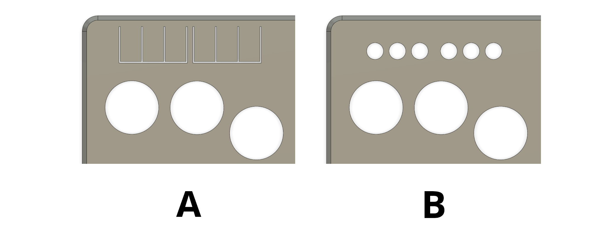
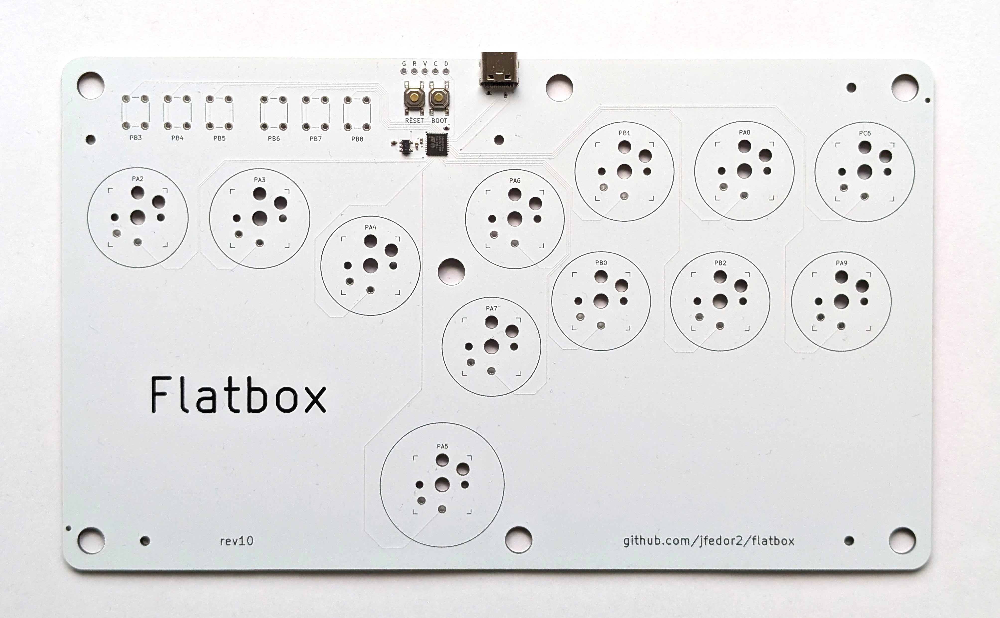
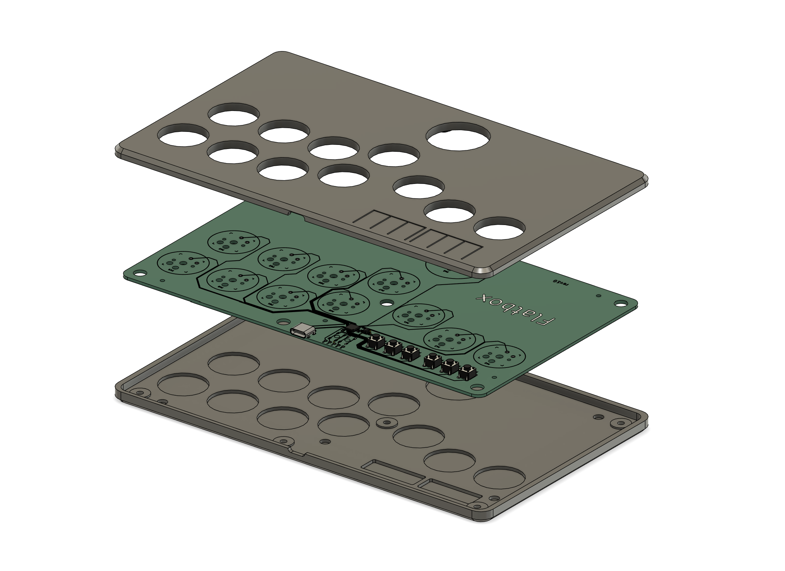

# Flatbox rev10

This is rev10 of the Flatbox. In this version the PCB includes the microcontroller (an STM32B0G1 chip) - everything is built in, you only have to add the switches (and flash the firmware).

There are two variants of the case, version A uses flaps for the option buttons, version B has holes so that you can use buttoncaps on the tact switches:



To make one you will need:

* [3D printed case parts](3d-printed-case) - top and bottom
* [the PCB](pcb)
* 12x Kailh low profile (choc v1) switches of your choice
* (optionally) 12x Kailh low profile hotswap sockets
* buttoncaps for the action buttons, either [3D printed](../3d-printed-buttoncaps) or (preferably) injection molded (make sure they're the correct size: 22.5mm and 28.5mm)
* for case variant A:
  * 6x 6x6x5mm tact switches
* for case variant B:
  * 6x 6x6x7mm tact switches
  * 6x silicone buttoncaps (like [these](https://www.aliexpress.com/item/32846395636.html) or search for "silicone button caps" on AliExpress; or you can use other caps as long as they fit, the hole diameter is 7.5mm)
* 7x M3x6 flat head (countersunk) screws
* 5x M2x4 screws to secure the PCB to the case
* some kind of rubber feet or non-slip padding for the bottom
* a soldering iron

I printed the case at 0.20mm layer height. The top part should be printed upside-down, the bottom part should be printed as-is. They don't require supports.

I used [JLCPCB](https://jlcpcb.com/) to make the PCB and assemble the SMD parts. The [included files](pcb) can be used with JLCPCB directly. If you want to use some other service, check the file formats that they expect. When ordering from JLCPCB, upload the Gerber zip, leave all the settings at default (you can choose the PCB color), then enable "PCB Assembly" and upload the BOM and CPL files in the next step. PCB thickness should be 1.6mm.

The PCB you get from JLCPCB will look like this:



The switches can be soldered in directly to the PCB or you can use hotswap sockets.

To put firmware on this board you will need a DFU compatible tool on your computer. This can be dfu-util, STM32CubeProgrammer or even a web based one like [this](https://devanlai.github.io/webdfu/dfu-util/).

If you're using dfu-util, the command will look something like this:
```
dfu-util -d 0483:df11 -a 0 -s 0x08000000:leave -D firmware.bin
```

When you connect a factory fresh board to your computer, it will enter firmware flashing mode (DFU bootloader) because the flash on the chip is empty.

First, flash the [flatbox_rev10-enable-boot0-pin.bin](binaries/flatbox_rev10-enable-boot0-pin.bin) file. This is a one time setup that will let you enter firmware flashing mode again using the BOOT button on the board. It is important you do this before flashing any other firmware as the BOOT button will not work otherwise. You only have to do this once. (See [here](https://github.com/jfedor2/stm32-enable-boot0-pin) for an explanation on why this is necessary.)

Now you can enter firmware flashing mode at any time by holding the BOOT button and pressing the RESET button.

Now flash the [pgf-flatbox_rev10.bin](https://github.com/jfedor2/portable-gamepad-firmware/releases/latest/download/pgf-flatbox_rev10.bin) file from the [Portable Gamepad Firmware](https://github.com/jfedor2/portable-gamepad-firmware) project.

If you ever want to flash another firmware, press and hold the BOOT button then press the RESET button to enter firmware flashing mode (DFU bootloader).

If you want to modify the case or the PCB, check out the files in the [extras](extras) folder.



PCB design licensed under [CC BY-SA 4.0](https://creativecommons.org/licenses/by-sa/4.0/).

PCB design uses the following libraries:

* [keyswitches.pretty](https://github.com/daprice/keyswitches.pretty) by [daprice](https://github.com/daprice) ([CC BY-SA 4.0](https://creativecommons.org/licenses/by-sa/4.0/))
* [Type-C.pretty](https://github.com/ai03-2725/Type-C.pretty) by [ai03-2725](https://github.com/ai03-2725)
